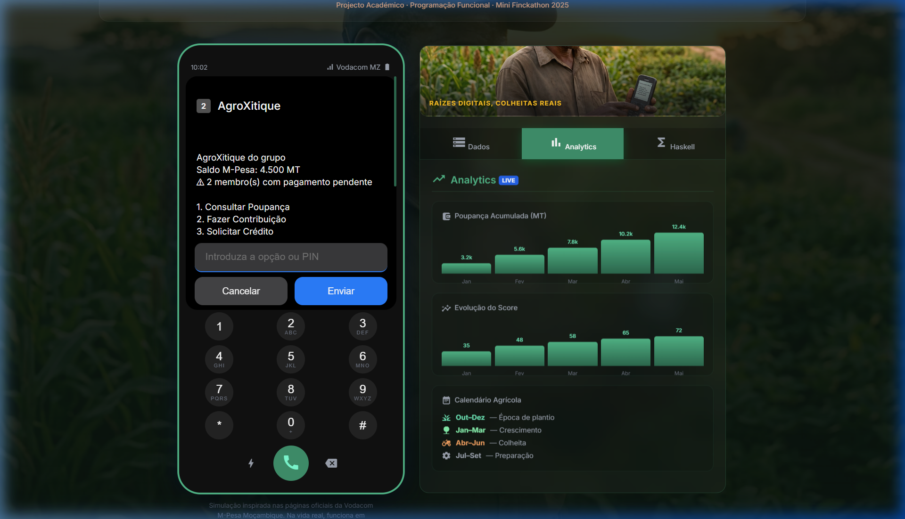
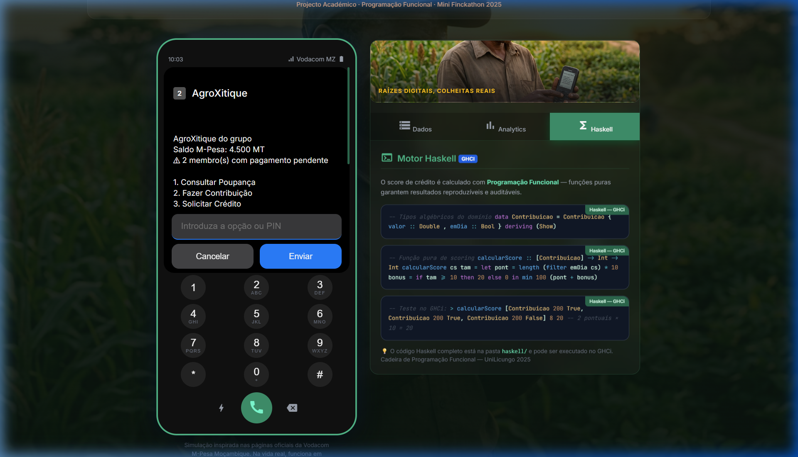

# 🌱 AgroXitique: Fintech Social para o Moçambique Rural

> **Projecto Vencedor — Simulação de Ecossistema USSD (*150#) para o Mini Finckathon 2025**  
> *Inovação, Segurança e Inclusão Financeira através da Programação Funcional.*

---

## 🎯 O Objectivo
O **AgroXitique** é uma solução de micro-finanças desenhada para colmatar a lacuna entre o sistema bancário tradicional e os pequenos agricultores em Moçambique. Utilizando a infraestrutura familiar do **Vodacom M-Pesa**, o sistema digitaliza o tradicional "Xitique" (poupança rotativa), adicionando inteligência de crédito baseada em dados reais.

## 🚀 Fluxo de Demonstração (The Winning Flow)
Para uma apresentação de impacto, siga este caminho no simulador:
1.  **Activação**: Marque `*150#` no teclado para iniciar a sessão oficial.
2.  **Navegação**: Vá a `4. Xitique M-Pesa` e descubra o novo menu `3. AgroXitique`.
3.  **Segurança**: Insira o **ID do Grupo (2025)** e valide a sua identidade com o **PIN M-Pesa**.
4.  **Gestão**: Explore o Dashboard em tempo real, veja o Score de Crédito e simule uma contribuição.
5.  **Onboarding**: Simule a criação de um novo círculo para ver a geração dinâmica de IDs e notificações SMS.

## 📸 Galeria do Simulador

  
  

  
  

  

## 🛠️ Arquitetura e Tecnologia (Para Estudantes de FP)
Este sistema foi construído sob os princípios da **Programação Funcional**, garantindo robustez e escalabilidade:

### 1. Lógica Funcional em Haskell (`/haskell`)
O "cérebro" do sistema reside na lógica de **Credit Scoring**. Os estudantes de Haskell podem explorar:
-   `Scoring.hs`: Algoritmos puros que calculam o risco de crédito baseados no histórico do grupo.
-   `Types.hs`: Tipagem forte para garantir que transacções financeiras nunca entrem em estados inválidos.
-   **Conceitos**: Imutabilidade, Funções de Ordem Superior e composição de funções.

### 2. Simulador USSD em JavaScript (`/js`)
O frontend utiliza uma abordagem de **Máquina de Estados**:
-   `screens.js`: Uma estrutura de dados declarativa que define toda a navegação.
-   `simulator.js`: O motor que processa inputs e renderiza a UI de forma reactiva.
-   `analytics.js`: Visualização de dados em tempo real.

## 👨‍🏫 Guia para a Equipa
Estudantes que queiram integrar a equipa devem focar-se em:
-   **Backend (Haskell)**: Refinar os pesos das variáveis de risco no motor de scoring.
-   **Frontend (JS)**: Implementar novos módulos USSD (ex: Seguros Agrícolas).
-   **UX/UI**: Manter a fidelidade visual aos padrões da Vodacom MZ.

---

**Desenvolvido por:** Prof. Filipe Domingos dos Santos  
**Instituição:** Universidade Licungo (UniLicungo)  
**Contexto:** Cadeira de Programação Funcional · 2025
