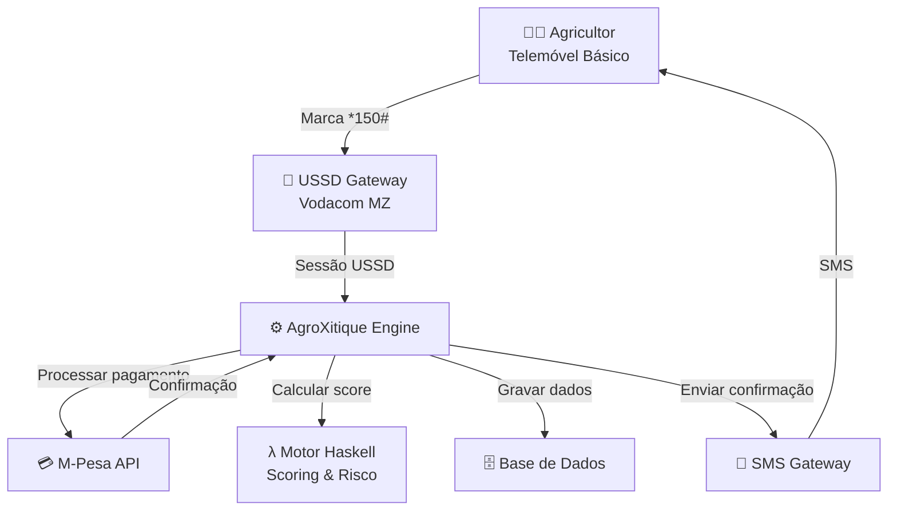

# 🌱 AgroXitique — Arquitectura Técnica

## Visão Geral



## Camadas do Sistema

### 1. Canal de Acesso — USSD (*150#)
- **Protocolo**: USSD (Unstructured Supplementary Service Data)
- **Vantagem**: Funciona em qualquer telemóvel (não precisa de smartphone)
- **Sem dados**: Não consome crédito de internet
- **Gateway**: Vodacom USSD Gateway (Moçambique)
- **Sessão**: Máximo 182 caracteres por ecrã, timeout de 120s

### 2. Pagamentos — M-Pesa API
- **API**: Vodacom M-Pesa Mozambique OpenAPI
- **Operações**: C2B (Customer-to-Business), B2C (pagamentos)
- **Segurança**: PIN do utilizador + token de sessão
- **Documentação**: [developer.mpesa.vm.co.mz](https://developer.mpesa.vm.co.mz)

### 3. Lógica de Negócio — AgroXitique Engine
- **Motor de scoring**: Implementado em Haskell (funções puras)
- **Gestão de grupos**: Criação, adesão, contribuições, alertas
- **Crédito**: Elegibilidade, simulação, reembolso
- **Notificações**: SMS automático após cada transacção

### 4. Motor de Scoring — Haskell

```haskell
-- Arquitectura do scoring
calcularScoreIndividual :: Membro -> Int -> ScoreResult
-- Compõe 5 factores independentes (funções puras):
-- 1. calcPontualidade   (40%)
-- 2. calcConsistencia   (30%)
-- 3. calcBonusGrupo     (10%)
-- 4. calcHistoricoCredito (15%)
-- 5. calcIndicacoes      (5%)
-- Menos: calcPenalidades
```

**Princípios aplicados:**
- **Pureza**: Mesmo input → mesmo output (auditável)
- **Composição**: Cada factor é uma função independente
- **Tipos algébricos**: ADTs para domínio (Contribuicao, Membro, ScoreResult)
- **Pattern matching**: Classificação do score e elegibilidade

### 5. Base de Dados
- **Entidades**: Grupos, Membros, Contribuições, Scores, Créditos
- **Tecnologia sugerida**: PostgreSQL (produção) / SQLite (protótipo)

## Fluxo de uma Contribuição

```
1. Maria marca *150# → Menu AgroXitique
2. Seleciona "Contribuir" → Ecrã de confirmação
3. Introduz PIN → M-Pesa debita 200 MT
4. Engine regista contribuição na BD
5. Motor Haskell recalcula score (+10 pts)
6. SMS enviado: "200 MT debitados. Score: 82/100"
7. Painel do grupo actualizado em tempo real
```

## Integração com o Calendário Agrícola

| Época | Meses | Actividade AgroXitique |
|-------|-------|----------------------|
| Preparação | Jul–Set | Poupança activa, score a crescer |
| Plantio | Out–Dez | Crédito para insumos disponível |
| Crescimento | Jan–Mar | Monitorização, reembolso inicia |
| Colheita | Abr–Jun | Reembolso do crédito, distribuição |

---

*Prof. Filipe Domingos dos Santos · UniLicungo · 2025*
